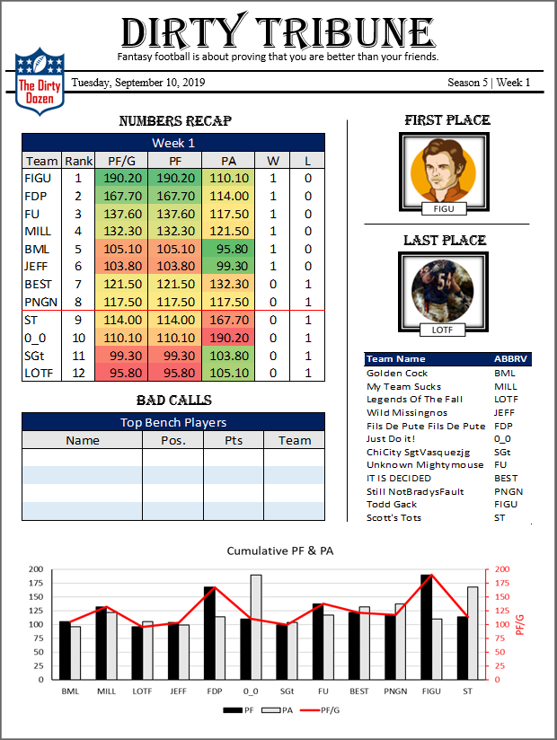
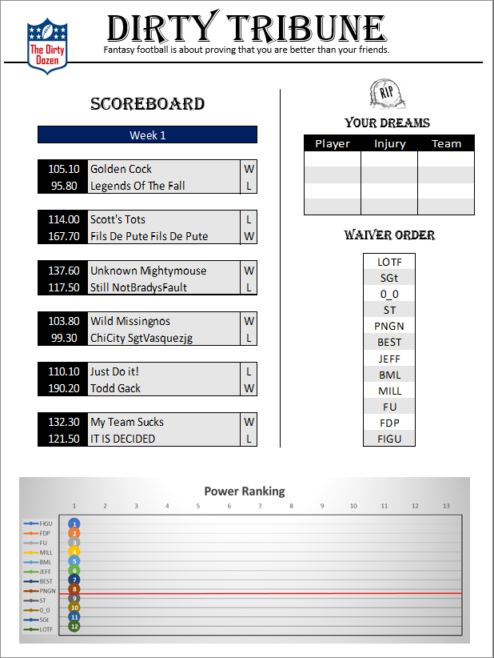

# Fantasy-football-weekly-report

When people play competetive games there is always inticipation or interest in their stats and data. This app is aimed towards commissioners of fantasy football leagues like looking at leaderboards/stats and want to keep owners interested throughout the year.

## How it works

<ul>
  <li>You pick which platform your league is in and what week you want the recap to show</li>
  <li>Depending on the platform you may need to provide more information such as username or league ID</li>
  <li>Press submit and the app will pull your leagues info through the API and download it into our database</li>
  <li>It will then pull from the database and display the stats on the screen!</li>
  <li>Press the `print to pdf` button and your report will download</li>
  <li>There is an overall stat page and a weekly stat page</li>
</ul>

## Visuals

  

## Roadmap

The app is compatiable with mobile and desktop. Sleeper and ESPN leagues both work. Other platforms like Yahoo, NFL, etc will be integrated if their API is available.
Will work on implementing GraphQL so accessing the APIs will be easier and React Native to deploy an app store version.

## Suggestions/Feedback

If you would like to suggest any improvements or have anything to say about the app please let me know through email at alexhwong18@gmail.com or https://www.linkedin.com/in/iamwong/

## Support

If you are having trouble using this site please let me know through linkedin https://www.linkedin.com/in/iamwong/ or shoot me an email at alexhwong18@gmail.com

