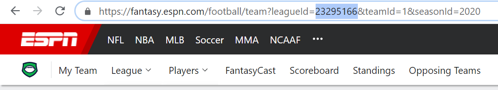
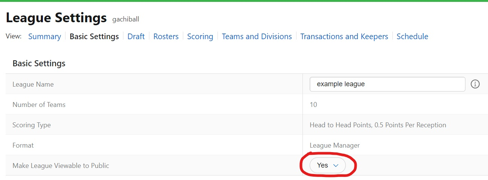
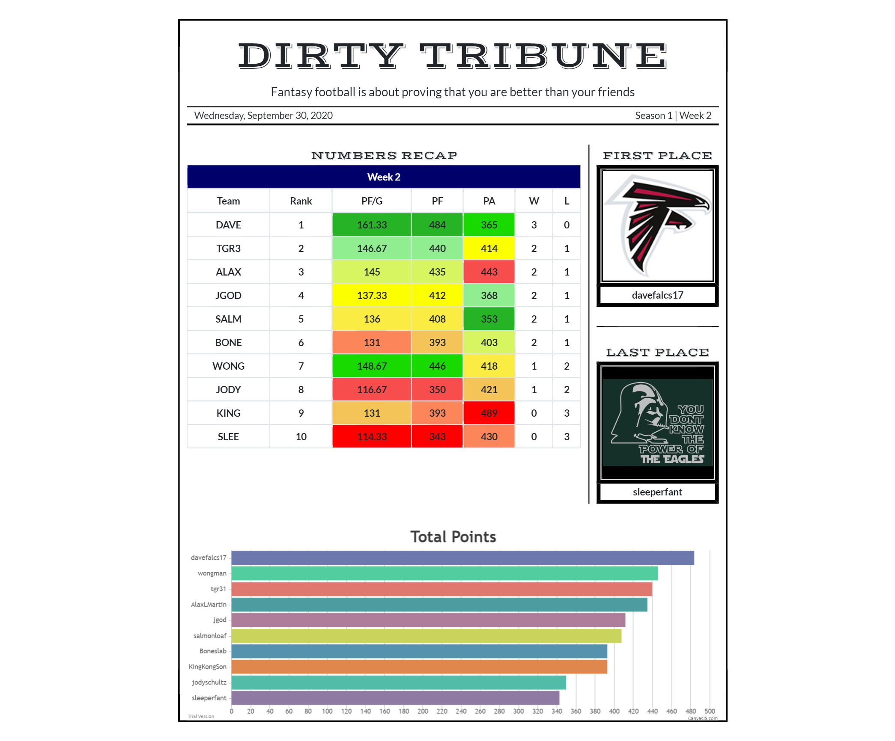
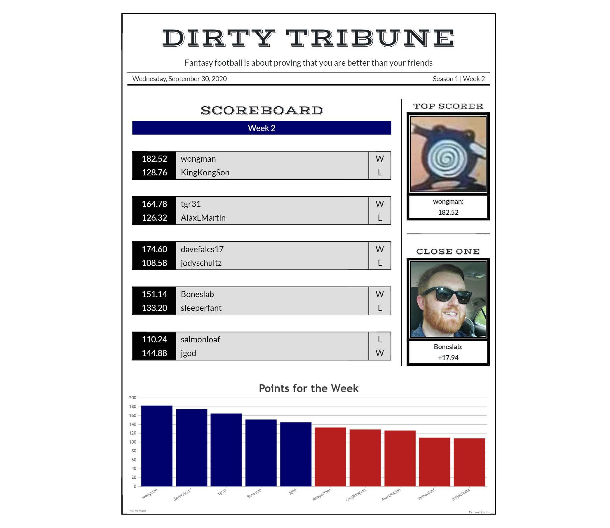

# Fantasy-football-Weekly-Report

When people play competetive games there is always anticipation or interest in their stats and data. This app is aimed towards commissioners of fantasy football leagues who like looking at leaderboards/stats and want to keep owners interested throughout the year.

## Table of Contents
* [Installation](#installation)
* [Technologies](#technologies)
* [How it works](#how-it-works)
* [Espn Guide](#espn-guide)
* [Sleeper Guide](#sleeper-guide)
* [Visuals](#visuals)
* [Roadmap](#roadmap)
* [Support](#support)


## Installation

To run this project, install it locally using npm:

```
 $ npm install
 $ npm start
```

## Technologies

Project is created with:
* Node version: 10.15
* React version: 16.13
* Bootstrap v4

## How it works

<ul>
  <li>You pick which platform your league is in and what week you want the recap to show</li>
  <li>Depending on the platform you may need to provide more information such as username or league ID</li>
  <li>Press submit and the app will pull your leagues info through the API and download it into our database</li>
  <li>It will then pull from the database and display the stats on the screen!</li>
  <li>Press the `print to pdf` button and your report will download</li>
  <li>There is an overall stat page and a weekly stat page</li>
</ul>

## Espn Guide

<ol>
  <li>Log on to the espn website. (ID cannot be viewed on the app)</li>
  <li>Copy or remember the highlighted number for your league. This is your league ID.</li>
</ol>



<ol start="3">
  <li>Go to your league settings and make the league viewable to public. (Can only be done by the league commissioner)</li>
</ol>




## Sleeper Guide 

<ul>
  <li>Only a username is needed! (my username will be provided as an example)</li>
</ul>


## Visuals


  




## Roadmap


The app is compatiable with mobile and desktop. Sleeper and ESPN leagues both work. Other platforms like Yahoo, NFL, etc will be integrated if their API is available.
Will work on implementing GraphQL so accessing the APIs will be easier and React Native to deploy an app store version.


## Suggestions/Feedback/Support


If you would like to suggest any improvements or have anything to say about the app please let me know through email at alexhwong18@gmail.com or https://www.linkedin.com/in/iamwong/
